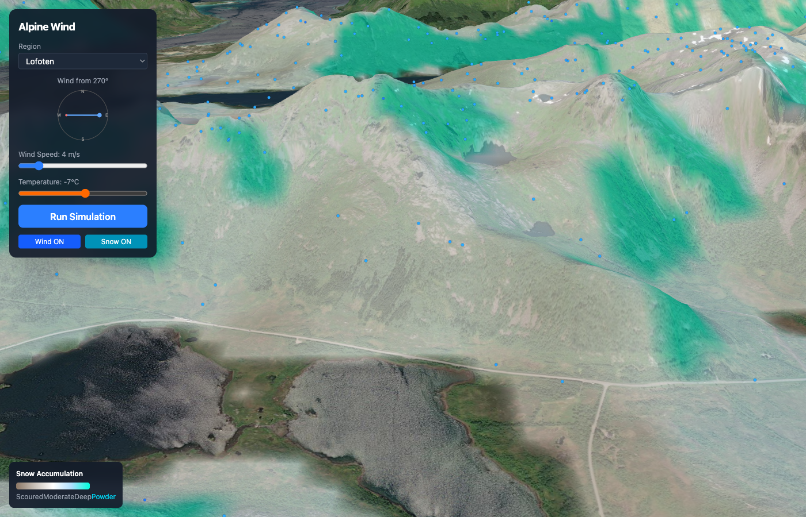

# Alpine Wind

3D wind flow simulator for alpine terrain. Models how different wind directions move through mountains and predicts where snow accumulates — helping you find the best powder.



## Features

- **3D Terrain** — Real-world elevation data via CesiumJS (Lofoten, Lyngen Alps, Narvik)
- **Wind Simulation** — Mass-conserving diagnostic wind model with terrain effects (ridge speed-up, lee-side shadows, valley channeling)
- **Snow Accumulation** — Heuristic model predicting snow deposition based on wind speed, slope aspect, elevation, and temperature
- **Particle Visualization** — Animated wind particles flowing through the terrain, color-coded by speed
- **Interactive Controls** — Wind direction compass, speed slider (0-30 m/s), temperature (-20 to +5 C)
- **Powder Zone Detection** — Highlights prime powder spots (cold dry snow + skiable slopes + wind-loaded lee sides)

## Quick Start

```bash
# Clone and install
git clone https://github.com/edevardHvide/alpine-wind.git
cd alpine-wind
npm install

# Set up Cesium Ion token (free at https://ion.cesium.com/tokens)
cp .env.example .env
# Edit .env and add your token

# Run
npm run dev
```

Open http://localhost:5173, wait for terrain to load, then click **Run Simulation**.

## How It Works

### Wind Model
A simplified diagnostic wind model (similar to WindNinja) that:
1. Initializes a uniform wind field with logarithmic vertical profile
2. Applies terrain interaction rules (windward deceleration, lee-side shadows, ridge speed-up)
3. Iteratively enforces mass conservation (divergence-free flow)

### Snow Model
Five-factor heuristic scoring per terrain cell:
- **Wind speed** (35%) — Low surface wind means snow stays in place
- **Lee deposition** (30%) — Slopes sheltered from wind accumulate drifted snow
- **Slope angle** (15%) — Steep slopes shed snow
- **Elevation** (10%) — Mid-upper elevations accumulate best
- **Temperature** (10%) — Cold = dry transportable snow, warm = sticky snow

### Visualization
- **Wind particles** — 800 points advected through the 3D wind field at ~2.5x real-time
- **Snow overlay** — Color-coded canvas texture draped on terrain (brown = scoured, white = moderate, blue = deep, cyan = powder zone)

## Tech Stack

- React 19 + TypeScript + Vite 8 + Tailwind CSS 4
- CesiumJS 1.139 (3D globe + terrain)
- No backend — all simulation runs client-side

## License

MIT
